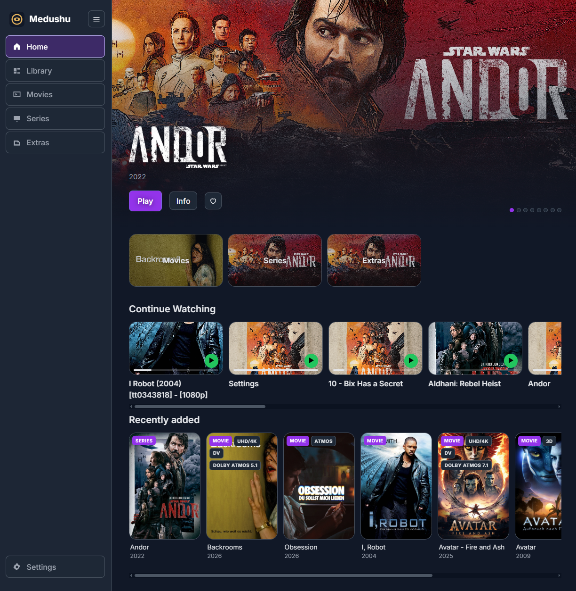

<p align="center">
  
</p>

<h1 align="center">Medushu</h1>

<p align="center">A direct-play personal media library. Original files, no transcode.</p>

## Preview

Narrow home on the NAS: overlay splash, Home / Favourites chips, then collection tiles and Recently added.

<p align="center">
  
</p>

Home shows a landscape hero, **Recently added**, then posters with filename quality pills (`UHD/4K`, `ATMOS`, `3D`). Item and play pages use a single **Back to Movies / Series / Music** control; the sidebar already has Library.

- SQLite catalog walked by this binary (Settings → Reindex starts on the next accept tick, including while something is playing)
- Hydrate reads local nfo and `[tt…]` IMDb ids without TMDB/TVDB keys (Cinemeta); optional keys still enrich
- Server-rendered HTML from `public/fragments/` + `public/app.css`
- HTTP Range of the original file (`GET` / `HEAD` / `206` / `416`)
- No FFmpeg, no HLS

Windows/WSL: native git for push/pull; WSL bash for compile and Docker. See [docs/dev-windows.md](docs/dev-windows.md).

## Run

```bash
bash scripts/dev-wsl.sh          # http://127.0.0.1:3090/  fixtures + .pw/dev/catalog.sqlite
# later: SKIP_COMPILE=1 bash scripts/dev-wsl.sh
bash scripts/dev-nas-link.sh     # map NAS movies/shows/… into .pw/dev/media
# then SKIP_COMPILE=1 bash scripts/dev-wsl.sh  → live nfo + Cinemeta hydrate
```

Compose / NAS:

```bash
bash scripts/build-image.sh
docker compose up                # :3090, binds /media /data /config
bash scripts/nas-deploy.sh       # musl image → registry → ssh compose recreate
```

## Index and hydrate

Settings → **Reindex** or `bash scripts/nas-index.sh` touches `reindex.requested`. The accept pump’s `! walk` arm runs the **whole walk on that tick** (it does not wait for STREAM idle, and it does hold accept/pump until the walk finishes).

Settings → **Hydrate now** encodes filename + nfo into the graph, then fetches posters/plot/trailers for `[tt…]` ids **one title per accept tick** so HTTPS does not freeze playback. TMDB/TVDB keys are optional. Live Cinemeta tests: `python3 scripts/test_hydrate_https.py`.

Python `scripts/index_media.py` / `scripts/hydrate_catalog.py` are CI/fixture only — not on the NAS.

## Test

```bash
bash scripts/test_all.sh
python3 scripts/test_hydrate_https.py   # live Cinemeta; skips if offline
```

Requires `koruc` at `$HOME/src/koru-build/zig-out/bin/koruc` and Zig 0.15.1. Frontend JS: `bash scripts/build-frontend.sh`.

## Layout

| Path | Role |
|------|------|
| `main.k` | `http:handler` → `media:dispatch`, accept pump |
| `src/consumers.kz` | HTML / JSON-LD / bytes from fragments |
| `src/catalog.kz` | SQLite walker |
| `src/hydrate.kz` | `! hydrate` (Cinemeta, optional TMDB/TVDB) |
| `public/fragments/` | page HTML filled at request time |
| `public/app.css` | tokens and chrome |
| `vendor/http/` | STREAM:v1 + accept loop |

See [docs/packaging.md](docs/packaging.md), [docs/releasing.md](docs/releasing.md), [ARCHITECTURE.md](ARCHITECTURE.md), [docs/protocol.md](docs/protocol.md).
